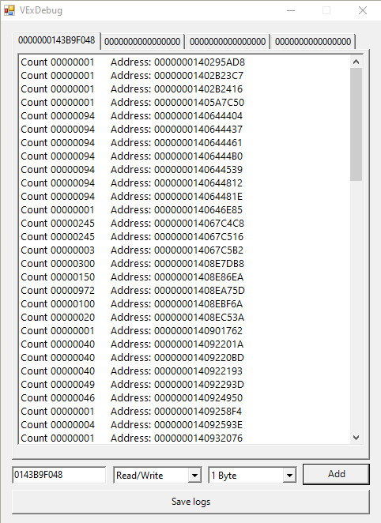
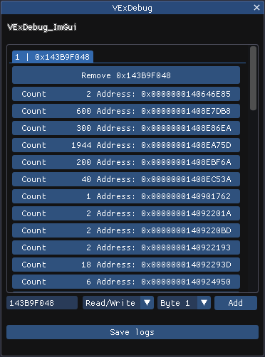

# VExDebugger

A debugger library using VEH.

## What is it ?

This is a simple debugger library for monitoring data access and writing using hardware breakpoints which manages debugging using the Windows Exception Handling system (inspired by VEH of the Cheat Engine).

> **Nota:** _This tool is in beta, it may have problems depending on some variant not yet tested._

## Compatibility

✔ Windows : 64 bits or 32 bits

## Breakpoint types

- [x] Write
- [x] Read/Write
- [ ] Execute

## Download

[Releases](https://github.com/SmoLL-iCe/VExDebugger/releases)

## How to use this?

You can compile your own project using the Debugger library or you can use one of the ready-made examples using the lib.
In the examples you will find ways to debug your own executable or create a dll to attach to another process and debug it. (use an injector for this.)
And Add the addresses you want to know who writes or accesses.

## What was used to compile?

- **Use Visual Studio** - ([Download](https://visualstudio.microsoft.com/pt-br/))
- **Platform tools** - Visual Studio 2022 (v143)
- **C++ SDK version used** - 10.0.22621.0

<h3 align="center">
  
</h3>

### .NET Sample C++/CLI

- **Common Language Runtime Support** - CLR
- **.NET version** - v4.8

<h3 align="center">
  
</h3>

### One of the examples uses [ImGui](https://github.com/ocornut/imgui)

## Author

[SmoLL-iCe](https://github.com/SmoLL-iCe)

## Thanks

- **VEH inspired:** [cheat-engine](https://github.com/cheat-engine)

## License

