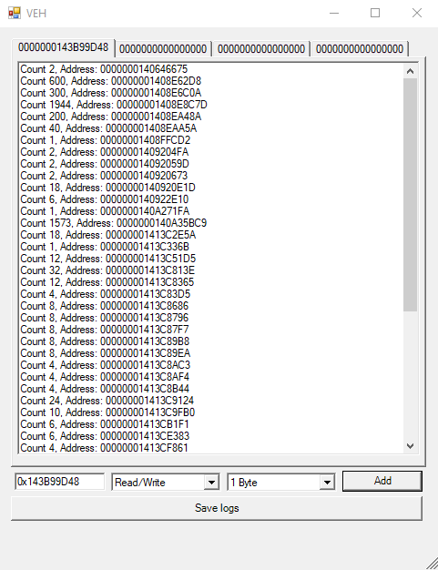

# VExDebug
 A debugger using VEH.

## What is it ?
is a simple access and write debugger that uses hardware breakpoints, and that manages debugging using the windows exception support system (based on the VEH of the Cheat Engine).

<h3 align="center">
  
</h3>

> __Nota:__ *This tool is in beta, it may have problems depending on some variant not yet tested.*

## Compatibility
✔ Windows 64 bits or 32 bits

## Breakpoint types
- [X] Write
- [X] Read/Write
- [ ] Execute

## Download
[Releases](https://github.com/SmoLL-iCe/VExDebug/releases)

## What was used to compile?
- __Use Visual Studio__ - ([Download](https://visualstudio.microsoft.com/pt-br/))
- __Platform tools__  - Visual Studio 2019 (v142)
- __C++ SDK version used__ - 10.0.18362.0
- __Packages__ - CLI CRL ( for forms )
- __.NET version__ - v4.5

## Author
[SmoLL-iCe](https://github.com/SmoLL-iCe)

## Thanks
- __VEH inspired:__ [cheat-engine](https://github.com/cheat-engine)

## License

